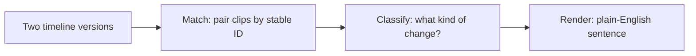
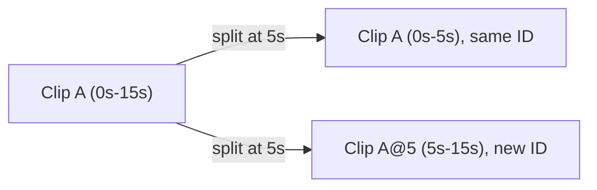
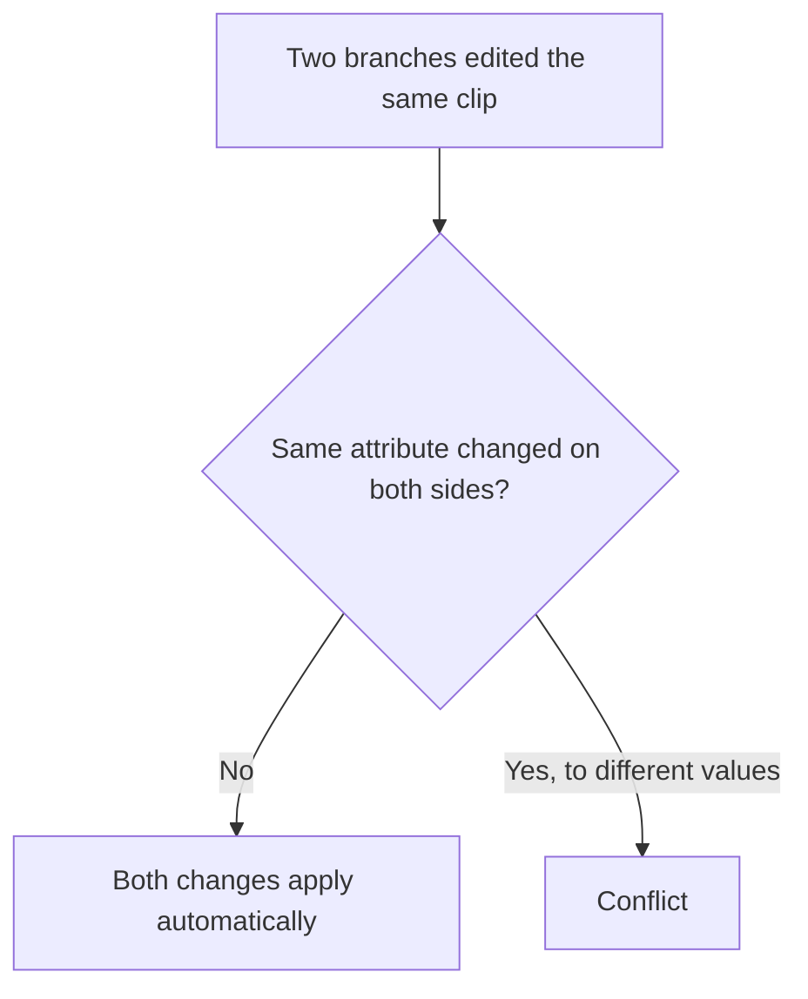

# FrameBranch — Algorithms

## The Diff Algorithm

Comparing two versions of a timeline works in three steps.

1. **Match** — find the same clip in both versions, using its stable ID, not its position. A clip keeps its identity even after being moved or split.
2. **Classify** — for each matched clip, figure out what kind of change happened: moved, trimmed, its source window shifted, a property changed (volume, opacity, scale, position, text), added, removed, or split into two. Each kind of change has its own fixed rule — there's no guessing involved.
3. **Render** — turn that classification into a plain-English sentence an editor can read, like "Clip A trimmed by 2s at the end" or "Volume changed from 50 to 80."

**Example.** A clip named "A" runs from 5s to 15s in one version. In the other, it's been trimmed to end at 12s. Match finds it's the same clip (same ID). Classify sees only its length changed, from the end. Render produces: "Clip A trimmed by 3s at the end."

A clip can have more than one kind of change at once — each gets its own sentence.

**Nothing gets missed.** The classify rules cover every field a clip can have: its position, its length, which part of the source file it shows, its properties, whether it exists at all, and whether it split. If a change ever doesn't fit one of these rules, the diff still describes it honestly — the raw before-and-after values — instead of crashing, staying silent, or guessing. There's always a truthful answer, never a missing one.

**Why there's no AI in this step.** A diff has to be exactly right every time, not just usually right — that's why this whole process is deterministic: fixed rules, fixed sentences, nothing that could produce a wrong or misleading description.

## Split Identity

When a clip is split into two, each piece needs an identity that stays stable for future edits and merges to refer to.

**The rule.** The left piece keeps the original clip's ID exactly as it was — only its length is now shorter, but it's still "the same clip." The right piece gets a new ID built from a formula: the original clip's ID plus the exact position it was cut at. Splitting clip "A" at the 5-second mark produces "A" (left) and "A@5" (right). If "A@5" gets split again later, its right piece becomes "A@5@8" — the formula just extends, no matter how many times a clip gets split.

**Why a formula instead of a random ID.** Suppose a person and the agent each split the exact same clip at the exact same position, on two separate branches, without knowing about each other's edit. Because the new ID is always computed the same way from the same inputs, both branches independently produce the exact same ID for the new piece. When the branches are merged, the system recognizes this immediately — same ID means same piece — and there's no conflict at all. If IDs were assigned randomly instead, the system would need extra logic just to notice two differently-named pieces are actually the same content.

**When a split meets another kind of edit.** If one branch splits a clip and, separately, another branch moves, trims, or changes a property on that same original clip, the second branch's single edit applies to every piece that came from the split — moving the clip moves both new pieces together, keeping the cut between them exactly where it was. If the other branch deleted the clip instead, that becomes one conflict covering every piece from the split, resolved together — so it's never possible to end up with half the split resolved and half of it hanging.

## The Merge Algorithm

**Comparing at the attribute level, not the clip level.** When two branches are merged, each clip is broken down into its individual attributes: where it sits on the timeline, how long it is, which part of the source file it uses, each of its six properties, and whether it exists at all. Two edits only conflict if they changed the exact same attribute of the exact same clip. If they changed different attributes — one side moved a clip, the other side trimmed it — both changes apply automatically, with nothing to resolve.

**Example.** On one branch, a clip is moved 3 seconds later. On another branch, the same clip's start is trimmed by 2 seconds. These touch different attributes (position vs. length), so the merge applies both — the result is the moved, trimmed clip.

**Only three kinds of conflict can ever happen.** Comparing two clips only ever asks three questions: does the clip exist on both sides? did the two sides set the same attribute to different values? and does combining two individually-fine changes break a rule, like causing an overlap? Nothing else is possible — those three questions cover every field a clip can have, so a conflict can never fall outside the three buckets the interface shows.

**Resolving conflicts.** Every time a person clicks a resolution button, that choice is saved permanently, and the entire merge result is recalculated from the beginning using every saved choice so far, rather than editing a half-finished draft directly. Clicking conflicts in a different order never changes the outcome, and nothing is lost if the connection drops mid-resolution — reopening the merge picks up exactly where it left off.

**Why it always finishes.** Resolving one conflict can sometimes reveal a new one — moving a clip out of one overlap's way might create a different overlap somewhere else. Even so, the number of conflicts that could ever exist for a given merge is fixed and finite, bounded by the number of clips and the limited set of positions each one could end up in. Resolution is guaranteed to run out of new conflicts and finish — it can never loop forever.

**The "shift" rule.** When a conflict is resolved by shifting a clip out of the way, it always moves to the nearest empty gap it fits into — whichever side is closer wins, and an exact tie goes to the earlier side. There's always room somewhere further along the timeline, so this option can never fail.

**One case needs no conflict check at all.** Ripple-delete — the operation that removes a clip and shifts everything after it left to close the gap — never needs to check for overlaps afterward. Since every clip after the deleted one shifts by exactly the same amount, the spacing between them never changes; this operation cannot create a new overlap.
