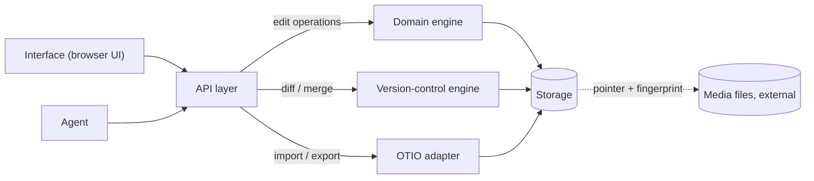
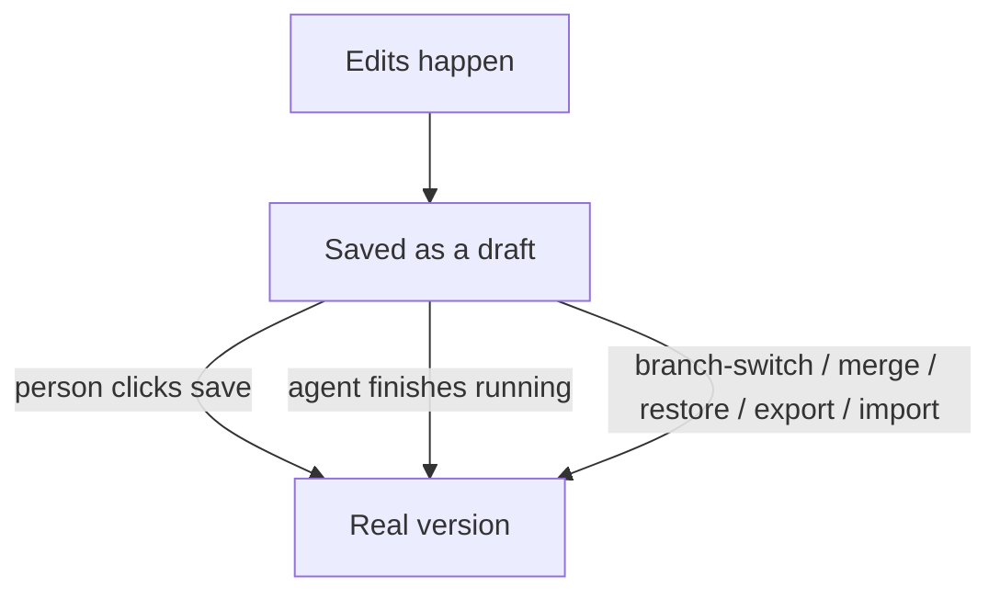
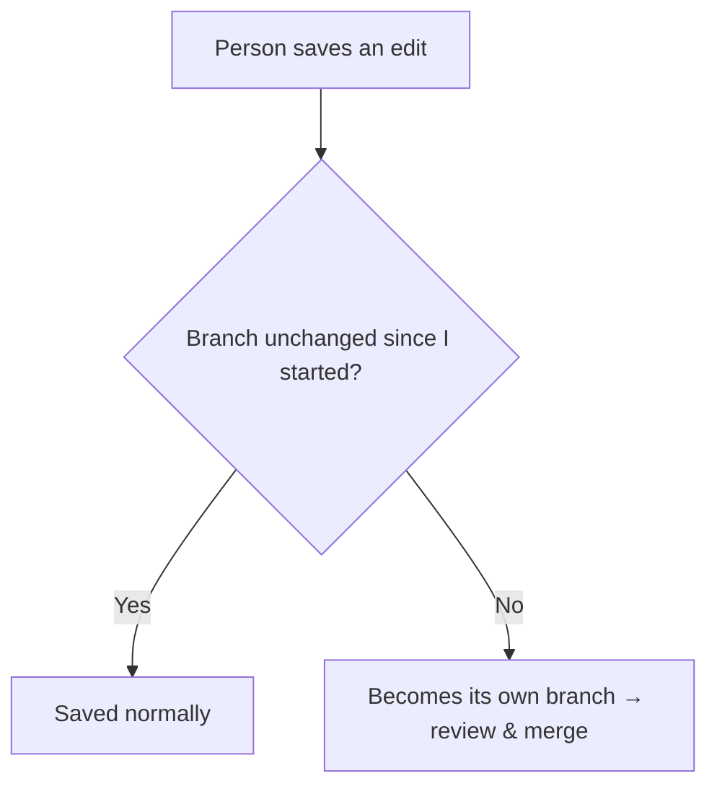
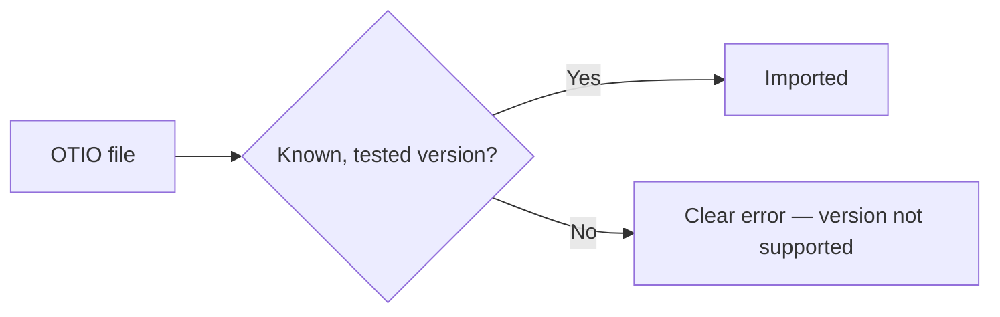

# FrameBranch — High-Level Design

## System Overview

FrameBranch has seven pieces:

- **Interface** — what a person sees and uses in the browser.
- **Agent** — produces the simulated edits (see PRD Scope).
- **API layer** — receives and validates every request, from either source.
- **Domain engine** — the rules of a video timeline: clips, the eight operations, what states are valid.
- **Version-control engine** — compares, finds conflicts, and combines two versions.
- **OTIO adapter** — reads and writes the OTIO file format for import/export.
- **Storage** — commits, branches, and history.

The domain engine, version-control engine, and OTIO adapter don't touch the interface, database, or network — they're plain functions, timeline in, timeline out. This keeps them independently testable and reusable.

FrameBranch doesn't store video or audio files itself — a media reference is just a URL pointing to wherever the file already lives, plus a fingerprint used to detect if that file changes. There's no upload or file-storage system in this version; the database only holds the URL and fingerprint, never the file.

## Data Flow

Every edit — from a person or the agent — follows the same path: the interface describes the edit, the API layer validates it, the domain engine applies it, and storage records the result before the interface updates. The agent's edits go through the identical path, tagged as coming from the agent.

## Storage & Data Model

**When does an edit become a real, saved version?**

Not right away. While a person is editing, their changes are held as a draft — saved automatically in the background, but not yet a permanent entry in the project's history.

That draft becomes a real, permanent version (a "commit") at one of three moments:

1. The person clicks save.
2. The agent finishes running — its whole set of edits becomes one version.
3. A few specific actions need a clean starting point, so they save the draft automatically before running: switching branches, merging, restoring an old version, exporting, or importing.

**What happens to old versions?**

Nothing is ever deleted or rewritten. Restoring an old version doesn't erase what came after it — it creates a brand-new version with the old content, so even a restore can be undone.

**How much does storing all this history cost?**

Each version remembers only what changed since the version before it. If the system only ever stored changes, going back to an old version could mean replaying hundreds of small changes one by one. To avoid that, a full copy of the whole timeline is also saved every 10th version — so going back to any version never takes more than 9 small replays.

**One more rule:** every save (a version, a merge, a restore) either fully succeeds or doesn't happen at all — there's no in-between broken state.

## API & Concurrency

**One endpoint for every edit.** Every edit — move, trim, delete, and so on — goes through one endpoint, described as data rather than a separate URL per operation. A new kind of edit later just needs a new description, not a new endpoint.

Other actions have their own endpoints: reading a timeline, history, or diff; branching; running the agent; merging; resolving conflicts; restoring; import/export.

**Handling collisions.** Nothing is locked while editing. Each save checks: is the branch still where I started? If yes, it saves normally. If not, the edit becomes its own branch instead of being lost or silently merged — same review-and-merge screen as any two branches.

**Safe retries.** Each edit carries a unique ID. A retried request with the same ID returns the original result instead of applying the edit twice.

## OTIO Interoperability

FrameBranch reads and writes projects using OTIO (OpenTimelineIO), a file format other video tools also support — so a project can move in and out of FrameBranch without a custom converter for each tool.

Only OTIO versions that have actually been tested against real files are accepted on import. An unrecognized version is never guessed at or silently misread — it shows a clear error naming which version is supported instead.

## Reliability

- **Any request failure** (network or server — treated the same) shows one banner: "Connection lost — your saved work is safe. Reconnecting…" Editing pauses, then auto-retries. No offline mode.
- **Agent runs are all-or-nothing** — a failed run saves nothing; the timeline stays untouched, with a retry option.
- **Security** — every request is schema-validated before reaching the engine; each public demo visitor gets an isolated copy with a reset button; no login system; secrets live only in environment variables.
- **Observability** — every request logs a structured line (actor, operation, branch, time, result) with a shared ID for tracing; errors include context, not just a code. No dashboards or alerts in this version.

## Scale & Deployment

**Benchmarks.** The core engine — diff, merge, the eight operations — is pure computation with no database or network involved, so it's been tested directly at scale: a 10,000-clip timeline computes a diff in about 3 milliseconds and a full three-way merge in under a second, measured and reproducible, not estimated (full results in `packages/engine/benchmarks/REPORT.md`).

**What would need to be added for a real product.** This version runs for one person and one agent on one project — there's no rate limiting and no user accounts, and the interface itself is only built and polished for a small, demo-sized timeline (10-30 clips), even though the engine underneath is proven at 10,000. Turning this into a multi-user product would mean adding: a way to limit how fast requests can come in, login and permissions, and an interface that stays fast with far more clips on screen. The underlying architecture doesn't need to change for any of this — the API and engine are already stateless, so they scale by running more copies, not by being rewritten.

**Where it runs.** The interface and API run on Vercel; the database is Postgres, hosted on Neon. The code is organized as two main pieces: the engine (which never imports anything related to the interface, database, or network) and the web app (interface + API). Automated tests, including 10,000 randomized test cases, run on every change before it ships.
