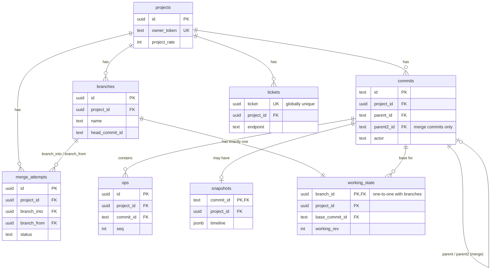

# FrameBranch — Low-Level Design

## Data Model

**Time.** Every point in time is two whole numbers — a count and a rate (frames per second) — never a decimal, because decimals accumulate rounding errors that break the exact equality diff/merge depend on. A project has one rate for its whole timeline; files at a different rate are converted once, at import, rounding to the nearest frame (an exact tie rounds down).

**Core types.**

| Type | Fields | What it is |
|---|---|---|
| `RationalTime` | `value` (int), `rate` (int) | A single point in time. |
| `TimeRange` | `start`, `duration` (both `RationalTime`) | A span of time. |
| `MediaRef` | `id`, `kind` (video / audio / image), `url`, `hash`, `sourceRate`, `durationInSource`, `sourceStartInFile` (optional) | A pointer to a media file — not the file itself. `sourceRate` and `sourceStartInFile` exist to bridge OTIO import/export; they don't affect diff/merge logic. |
| `Lineage` | `rootId`, `span` (`TimeRange`) | Tracks where a clip came from when it was produced by a Split. See Algorithms for how this is used. |
| `Clip` | `id`, `mediaRefId`, `sourceRange`, `timelineRange`, `properties`, `lineage` | A piece of media placed on the timeline. `sourceRange` is which part of the file to use; `timelineRange` is where it sits on the timeline. |
| `TextClip` | `id`, `timelineRange`, `textContent`, `textStyle`, `properties` (optional), `lineage` | A caption or text element — a clip without a media file. |
| `Track` | `id`, `kind`, `clips` | A lane holding a sequence of clips. |
| `Timeline` | `projectRate`, `tracks`, `mediaRefs` | The whole project. |

A clip's `id` never changes for as long as that clip exists — it's how diff and merge recognize "this is the same clip" across two versions. Every `Clip` and `TextClip` also carries a `lineage`, set once when the clip is created (by an Add, or by a Split producing two new clips) and never changed after — this is what lets split matching and three-way merge tell "these two clips came from the same original piece" apart from "these two clips just happen to look similar."

**Images have no natural length** — unlike video or audio, an image could be shown for 2 seconds or 2 minutes, both valid. So `durationInSource` is empty ("unlimited") only for images; it's always a real number for video and audio.

**Rules that always hold, for every timeline** (the shared invariant sweep in `invariants.ts`, checked after every command and after every merge):

1. No two clips on the same track overlap.
2. A clip's source range never points outside the length of its source file (skipped for images, which have no fixed length).
3. Every span of time has a duration greater than zero — nothing is zero-length or backwards.
4. A clip's timeline start is never negative.
5. For media clips, the source range's duration equals the timeline range's duration — no speed changes in this version.
6. A text clip's content is never empty.

These are the true global invariants — they hold for every timeline, always. Separate from these are preconditions checked per-operation (for example, "Slip doesn't apply to images" or "a property must apply to this kind of clip") — those are enforced at the point an operation or import runs, not swept globally.

## Operations

Every operation is checked before it runs — if a check fails, nothing changes and a specific error comes back. (Split has its own entry in Algorithms — its identity rules are covered there, not repeated here.)

| Operation | You send | Checked first | What happens | Undo |
|---|---|---|---|---|
| Add clip | track, media, which part of the file, where on the timeline | Track and media exist; the piece fits inside the file; no overlap; times are valid; media type matches the track; rate matches the project | A new clip appears on the track | Delete it |
| Delete clip | clip ID | Clip exists | Clip disappears; the gap stays — neighbors don't shift | Add it back exactly as it was |
| Move | clip ID, new start time | Clip exists; new position doesn't overlap another clip; rate matches | Only the clip's position changes | Move it back |
| Trim | clip ID, which edge, how much | Resulting length stays positive; extending has enough source material and doesn't overlap a neighbor | Both the source window and the timeline position shift together at that edge | Trim the same edge back |
| Slip | clip ID, how much | The new source window stays fully inside the file | Only which part of the file is shown changes — timeline position is untouched | Slip back the same amount |
| Change a property | clip ID, property, value | The property applies to this kind of clip; the value is in range | Only that one property changes | Set it back to the old value |
| Ripple delete | clip ID | Clip exists | Clip disappears, and everything after it on the same track shifts left to close the gap | Shift everything back right, then add the clip back |
| Split | clip ID, cut point (time) | Clip exists; cut point is strictly inside the clip — a cut exactly on either edge is rejected (`E_SPLIT_AT_BOUNDARY`), as is a cut outside the clip's range (`E_SPLIT_OUT_OF_RANGE`); a 1-frame clip can't be split at all | Clip becomes two: the left piece keeps the original ID, the right piece gets a new ID chained from the cut's root-local lineage coordinate (extended deterministically if that ID is already in use). Both pieces get their own `lineage.span`. See Algorithms for why the ID uses the lineage coordinate, not the timeline position | A single atomic composite: remove the right piece, then restore the left piece from its pre-split state |

**Move is same-track only.** Moving a clip to a different track isn't supported in this version — it isn't needed for the demo, and it would open up a new family of diff and merge cases that don't otherwise exist.

**Text clips use the same operations**, minus anything about a source file — there's no `sourceRange` to trim or slip, since a text clip has no underlying media. Slip doesn't apply to images either, for the same reason: there's no file window to shift.

**A no-op is still a success, not an error.** Trimming by zero, or setting a property to the value it already has, succeeds and changes nothing — it isn't recorded as an edit, so history stays free of noise from actions that didn't actually change anything.

## Database Schema

Eight tables, each with one clear job.

| Table | Stores | Key columns |
|---|---|---|
| `projects` | One row per project | project rate, owner token (keeps each demo visitor's copy separate) |
| `branches` | Each branch's name and current position | name, head commit |
| `commits` | Every saved version | parent commit (two, only for a merge), who made it, name, import warnings if it came from an import |
| `ops` | The individual edits inside a commit, in order | the edit itself, who made it |
| `snapshots` | A full copy of the timeline — saved every 10th commit, and always for import, restore, and merge commits | the whole timeline, as JSON |
| `working_state` | One row per branch — edits made but not yet committed | pending edits, a counter that increases with every edit |
| `merge_attempts` | An in-progress merge — deleted once it's finished or cancelled | the draft result, the conflict list, saved resolution choices |
| `tickets` | One row per request, so a retried request is never applied twice | which action it was, the stored result |



`branches_project_id_name_key` and `projects_owner_token_key` are the other unique constraints worth knowing about: a branch name is unique per project, and an owner token identifies exactly one project. Full column list is `apps/web/src/db/schema.ts`; this diagram is for relationships, not every field.

## API Reference

**Every response has the same shape.** Success: `{ ok: true, data: {...} }`. Failure: `{ ok: false, error: { code, message } }` — `code` is for the interface to act on, `message` is for a person to read. Every endpoint uses this same envelope.

**Reading data** doesn't need a ticket, since nothing changes: getting the current timeline, the history, or a diff between two versions.

**Every edit goes through one endpoint** (`POST ops`, described in Operations). Every other action — save a version, create a branch, switch branches, merge, resolve a conflict, cancel a merge, restore a version, run the agent, import, export, reset the demo — has its own endpoint, but all follow the same pattern: state which branch, include a ticket, get back the same envelope shape.

**Which branch, every time.** Every request scoped to a branch says which one explicitly — the server never remembers "the branch you were just on." This keeps two browser tabs on different branches from interfering with each other.

**Retries are safe.** Every request that changes something carries a ticket — a unique ID generated by the interface. If the same ticket is sent twice (a retry after a dropped connection, or a double-click), the server returns the exact same result it returned the first time, instead of applying the change again.

**Errors fall into three groups.**

| Group | Meaning | Examples |
|---|---|---|
| Operation errors | This specific edit isn't allowed right now | clip not found, would overlap another clip, value out of range |
| System errors | Something about the request's context is stale or missing | branch not found, someone else already changed this branch |
| Request errors | The request itself couldn't be understood, or something unexpected happened on the server | malformed request, branch name already taken, unexpected failure |

Each error's `code` is one specific, fixed string (like `E_OVERLAP` or `E_STALE_REV`) — the interface reacts to the code, not the message.

**Endpoint matrix.** Every route below shares the envelope and ticket rules already described. Request/response fields are shortened to the essentials — the full shape is in each route's Zod schema.

| Path | Method | Mutating? | Ticket? | Main input | Main output | Stale/idempotency behavior |
|---|---|---|---|---|---|---|
| `/api/timeline` | GET | no | no | `branch` | timeline, working rev, pending count | n/a — read-only |
| `/api/history` | GET | no | no | (project from context) | commits: id, name, actor, time, parents | n/a — read-only |
| `/api/diff` | GET | no | no | `from`, `to` | diff entries + plain-English sentences | n/a — read-only |
| `/api/ops` | POST | yes | yes | `branch`, `workingRev`, `command` | new working rev, pending count | working-rev mismatch → `E_STALE_REV` |
| `/api/commit` | POST | yes | yes | `branch`, `name?` | commit id, name | CAS on branch head → `E_STALE_HEAD`; no-op if branch is already clean |
| `/api/branch` | POST | yes | yes | `name`, `from` | branch id, head commit id | seals the source branch first → `E_STALE_HEAD` possible; `E_BRANCH_EXISTS` if name taken |
| `/api/branch/switch` | POST | yes (may seal) | yes | `from`, `to` | timeline, working rev, pending count | seals dirty state before switching → `E_STALE_HEAD` possible |
| `/api/agent/simulate` | POST | yes | yes | `branch`, `script` | commit id, ops applied | CAS on branch head → `E_STALE_HEAD` |
| `/api/merge` | POST | yes | yes | `into`, `from` | attempt id + conflicts, or an auto-finalized commit if there are none | pre-merge seals → `E_STALE_HEAD`; unresolvable start → `E_MERGE_PRECONDITION` |
| `/api/merge/resolve` | POST | yes | yes | `attemptId`, `conflictId`, `choice` | remaining conflicts, or the finalized commit | invalid/duplicate choice → `E_MERGE_PRECONDITION`; finalizing the last conflict can hit `E_STALE_HEAD` |
| `/api/merge/abort` | POST | yes (discard) | yes | `attemptId` | `{ aborted: true }` | missing attempt → `E_MERGE_PRECONDITION` |
| `/api/restore` | POST | yes | yes | `branch`, `commitId` | new commit id, name | seals before restoring → `E_STALE_HEAD` possible |
| `/api/import` | POST | yes | yes | `branch`, `otioJson` | commit id, skipped items | seals first → `E_STALE_HEAD`; import failure writes nothing |
| `/api/export` | POST | yes (may seal) | yes | `branch` | OTIO JSON, commit id | seals first → `E_STALE_HEAD` possible |
| `/api/demo/reset` | POST | yes (discard) | yes | (none) | `{ done: true }` | deletes and reseeds the project's rows |

Every mutating route requires a `ticket` field, replayed through `runWithTicket`: the same ticket on the same endpoint returns the stored result instead of re-applying the change; the same ticket reused on a *different* endpoint is rejected with `E_TICKET_REUSED`.

## OTIO Adapter Details

OTIO's model differs from FrameBranch's in a few ways the import/export code has to bridge.

| | OTIO | FrameBranch |
|---|---|---|
| A clip's position | Worked out from what comes before it | Stored directly |
| Empty space | A real object (a "Gap") | Not stored — just an absence |
| Time rate | Each value can carry its own rate | One rate for the whole project |
| Media length | Optional — can be missing | Required, except for images |
| Text / captions | No native concept | A real clip type |

**How gaps are handled.** On import, empty space between clips isn't turned into anything — it's just skipped over while placing each clip at the right position. On export, gaps are reconstructed exactly, calculated from the space between where one clip ends and the next begins, since OTIO needs that empty space written out explicitly, or every following clip would silently shift.

**Missing media length.** A video or audio file with no length information in the OTIO file is skipped on import, with a warning — the media itself isn't missing, just that one piece of information, and the engine has no way to independently discover a file's length (it never opens media files, only references them). Images don't have this problem, since they have no natural length to begin with.

**Text clips.** OTIO has no concept of a caption or text clip. To keep FrameBranch's own export-then-import round trip lossless, a text clip is written into OTIO's generic metadata field on export, and read back from there on import. Other tools opening the same file won't understand this — it exists purely so FrameBranch doesn't lose information when it exports and re-imports its own projects.

## Code Organization

```
packages/engine/src/
  time.ts        — time representation and rate conversion
  types.ts        — the data model (Data Model section)
  invariants.ts   — the one shared list of rules every command must satisfy
  verbs/          — the 8 operations
  diff/           — the diff algorithm
  merge.ts        — the merge algorithm (kept as one file — its logic is
                     too interconnected to split cleanly)
  otio/           — import/export
  index.ts        — the only entry point other code is allowed to use
```

**One narrow door in.** Everything outside the engine — the interface, the API layer — only ever imports from `index.ts`, never reaches into the internal files directly. `index.ts` exposes exactly seven functions: apply a command, compute a diff, start a merge, apply a conflict choice, check if a merge can finalize, import OTIO, export OTIO. As long as those seven keep working the same way, anything inside the engine can be reorganized freely without breaking anything outside it.

**No database, no network, no interface code anywhere in the engine.** Every function here takes a timeline in and returns a timeline (or a diff, or a merge result) out — which is what makes it possible to test and benchmark the engine directly, without running a server or a browser.
